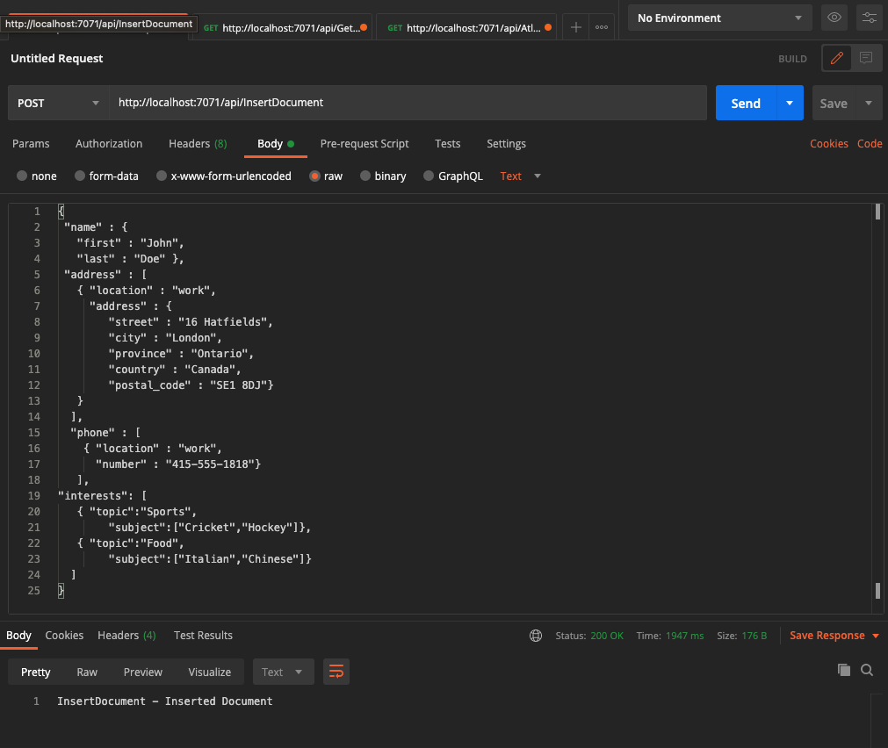
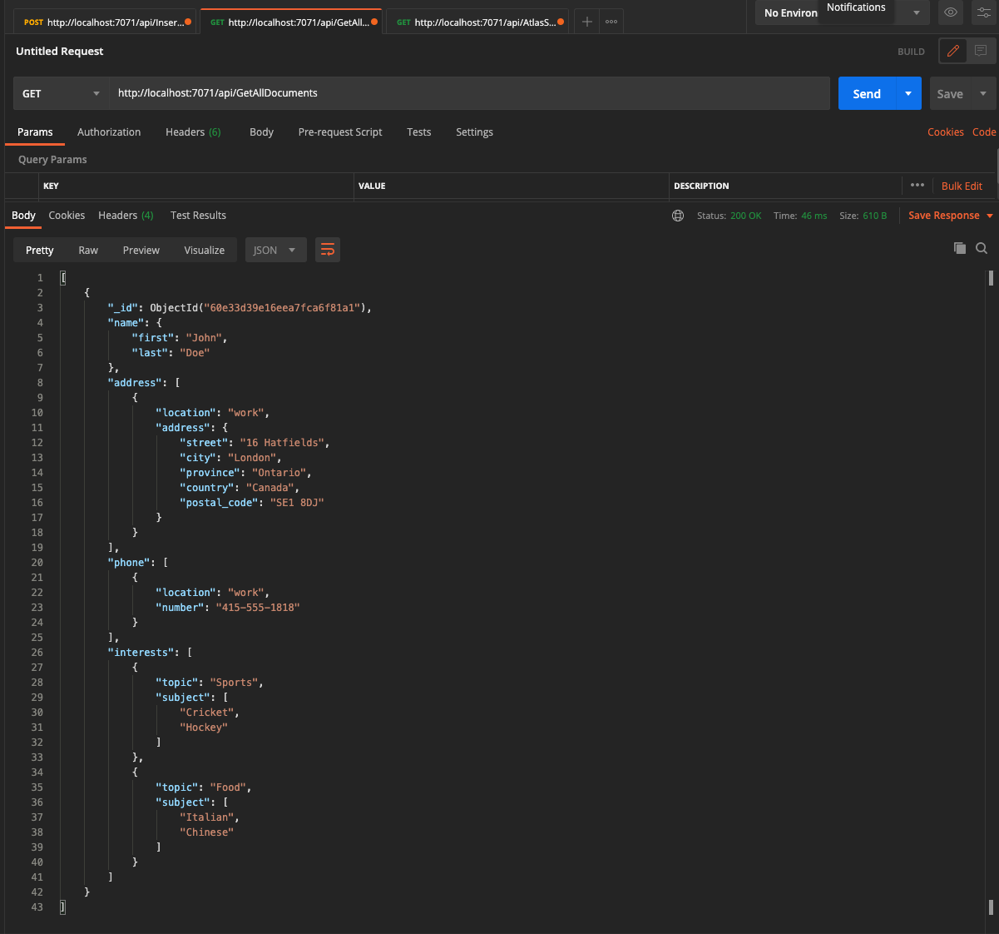
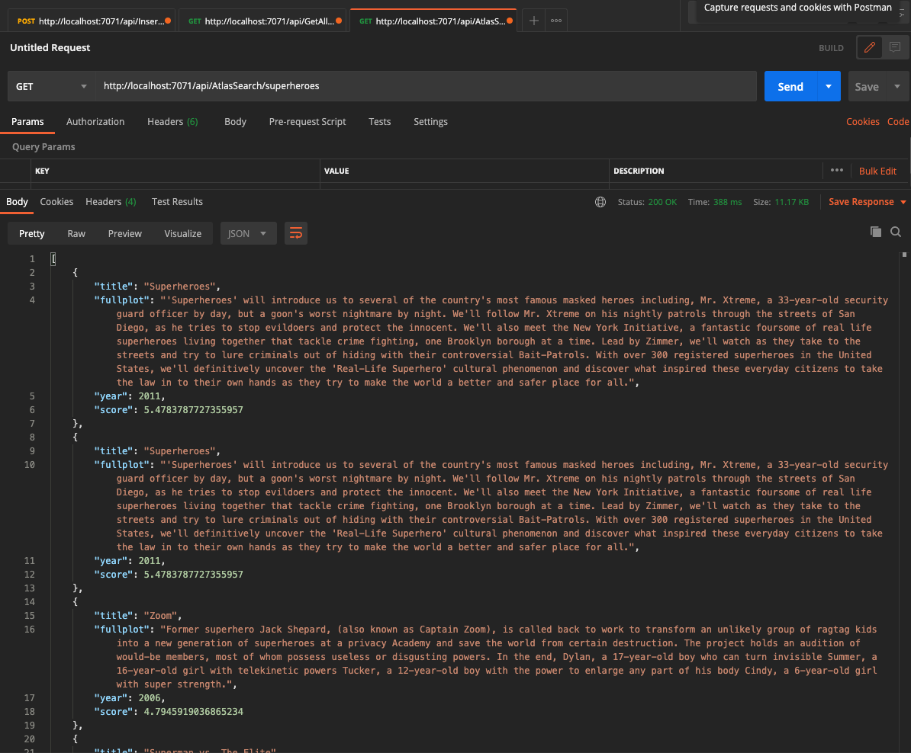

# MongoDB Atlas, Atlas Search and C# Azure Functions

An example of how to integrate MongoDB Atlas with C# Azure Functions. This also demonstrates how to use Atlas Search in an Azure Function using C#.

This is using the [Azure Functions HTTP trigger](https://docs.microsoft.com/en-us/azure/azure-functions/functions-bindings-http-webhook-trigger?tabs=csharp) to interact with [MongoDB Atlas](https://www.mongodb.com/cloud/atlas). The HTTP trigger will allow you to use this function as a REST API, which we’ll be able to call from [cURL](https://en.wikipedia.org/wiki/CURL), [Postman](https://www.postman.com/), or any custom application.

As a [MongoDB best practice](https://mongodb.github.io/mongo-csharp-driver/2.12/reference/driver/connecting/#re-use):
>"It is recommended to store a MongoClient instance in a global place, either as a static variable or in an IoC container with a singleton lifetime."

This example uses [dependency injection in .NET Azure Functions](https://docs.microsoft.com/en-us/azure/azure-functions/functions-dotnet-dependency-injection) in order to keep a singleton MongoClient instance. 

Note that the AuthorizationLevel is set to Anonymous so you may want to change this to lock access.

## Prerequisites
You will need to add your own `local.settings.json` file which has the following options:

```
{
   "IsEncrypted": false,
   "Values": {
      "MongoDBOptions:CONNECTION_STRING": "<your MongoDB Atlas connection string>",
      "MongoDBOptions:DATABASE_NAME": "<your database>",
      "MongoDBOptions:COLLECTION_NAME": "<your collecion>"
  }
}
```

### Atlas Search
For Atlas Search, you will need to have [loaded the sample data into your Atlas cluster](https://docs.atlas.mongodb.com/sample-data/). This example uses the `sample_mflix` database and the `movies` collection and you will need to create an Atlas Search Index for that collection using this [tutorial](https://docs.atlas.mongodb.com/reference/atlas-search/tutorial/create-index-ui/).

## Running the Solution

When you run this solution in Visual Studio 2019 you will have the following Azure Functions available on your local machine:


      AtlasSearch: [GET] http://localhost:7071/api/AtlasSearch/{query}

      GetAllDocuments: [GET] http://localhost:7071/api/GetAllDocuments

      InsertDocument: [POST] http://localhost:7071/api/InsertDocument

## Examples

Test the REST API calls to the Azure Functions using [Postman](https://www.postman.com/).
### InsertDocument: [GET] http://localhost:7071/api/InsertDocument


### GetAllDocuments: [GET] http://localhost:7071/api/GetAllDocuments


### AtlasSearch: [GET] http://localhost:7071/api/AtlasSearch/{query}



